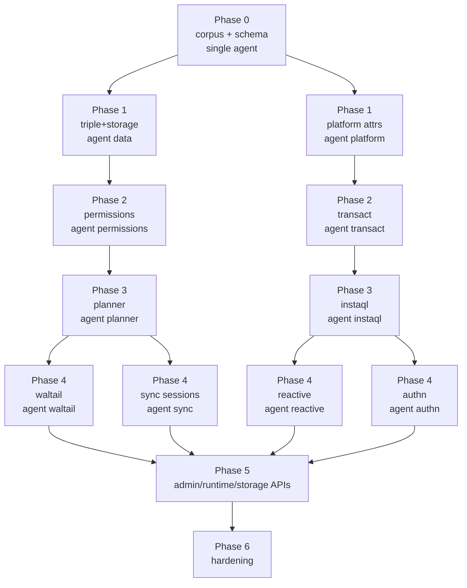

# 06 — Sub-agent Orchestration

How the rewrite is executed by multiple agents without stepping on each other and
without turning the roadmap into a single-threaded relay.

## 1. Roles (use whoever your harness provides)

| Harness role | V2 function | Write scope |
|---|---|---|
| **scout** (read-only, fast) | Corpus analysis, v1 evidence gathering, preflight checks before a phase starts | Reads only; hands distilled report to implementors |
| **implementation_worker** | One phase fragment on a disjoint package set | A designated `internal/*` subtree + its `*_test.go`; no other package |
| **test_worker** | Soak/property-test authoring, harness hardening, failure triage | `tools/corpusctl`, `internal/*/testdata`, `corpus/`; never product logic |
| **debugger** | Multi-cause failure isolation when `replay` diverges and the owning package isn't obvious | Reads all product packages; writes only the owning one once root-caused |
| **reviewer / security_reviewer** | Correctness pass before a phase gate, then trust-boundary pass for auth/storage/billing-facing packages | Read-only review of the phase gate's diff |

Harness experiment names (`trial_luna_*` / `trial_terra_*` / `trial_sol_*`) map to the
same contracts above. Prefer experiment-roled agents while that experiment is active.

## 2. Ownership map (exclusive)

No two write-capable agents touch the same path concurrently. File ownership is per
package directory, not per file, so boundary violations cannot hide behind renames.

| Owner | Package | Phase gate that births it |
|---|---|---|
| `infra` | `tools/corpusctl`, `tools/schemagen`, `internal/protocol`, `migrations/`, `cmd/instantd` skeleton | 0 |
| `data` | `internal/triple`, `internal/storage` | 1 |
| `platform` | `internal/platform` | 1 |
| `permissions` | `internal/perms` | 2 |
| `transact` | `internal/transact` | 2 (parallel with `permissions` on distinct packages) |
| `planner` | `internal/datalog` | 3 |
| `instaql` | `internal/instaql` | 3 (parallel with `planner` across the IR type boundary) |
| `waltail` | `internal/waltail` | 4 |
| `reactive` | `internal/reactive` | 4 |
| `sync` | `internal/sync` (session/presence/rooms) | 4 |
| `authn` | `internal/authn` | 4 (parallel with `sync` — no shared files) |
| `adminapi` | `internal/adminapi` | 5 |
| `runtimeapi` | `internal/runtimeapi` | 5 |
| `storageapi` | `internal/storageapi` | 5 |

Boundaries are stated in the **Contract** section of every task batch (see §4).
Implementation agents that need a cross-package change must ask the main orchestrator
via `hub`, who owns the interface in `docs/02-architecture.md` §4.

## 3. Contract for every task batch

Every `task` dispatch has a `context` with three sections:

```
# Goal        — which phase gate we're driving
# Constraints — frozen-surface invariants (from 03), no-Op-Spec-drift, idiomatic Go
# Contract    — the Go interfaces that phase spans (copied from 02 §4)
```

Each `task.task` has:

```
# Target      — exact package(s) and symbols; explicit non-goals
# Change      — step-by-step: add/remove/rename, SQL shape, CEL binding sets, frame shapes
# Acceptance  — observable result: corpus suite names that must pass; coverage bar
```

*Task prose is not allowed to say "make it work".* It names the suites from 05 §2.3 that
constitute done for that task.

## 4. Phase parallelism pattern



*Within* a phase, sibling packages can ship in parallel because they share only the
interface types defined in 02 §4, whose compilation is the first commit of that phase
(owned by the main orchestrator — a single text commit, no logic). After that commit,
agents never negotiate the interface via `hub`; they type-check against it.

## 5. Gating, review, and escalation

1. Each task skips formatters/linters/project-wide tests. Tests are scoped (`go test ./internal/<owner>`).
2. When a task claims done, the test worker runs its exclusive suites (`corpusctl replay --target v2` slice + unit tests).
3. The reviewer does a read-only correctness pass on the phase's combined diff; security reviewer joins for `authn`/`storageapi`/`perms`.
4. Only when all suites referenced in the Contract are green does the phase gate flip. The main orchestrator merges.
5. **Repair loops** are capped at two cycles. On second failure, the owning agent **escalates** (Luna→Terra, or implementation_worker→debugger) with the `corpusctl differential` output attached. No third silent retry.
6. Concurrency cap: ≤ 3 writers at once by default (per repo harness rule).

Critical **exclusions**:

- Sub-agents never commit/push/deploy or contact people. The orchestrator merges.
- Sub-agents never change the protocol schema or the interfaces in 02 §4 — main orchestrator only.
- Overlapping file ownership across a batch is disallowed; the main orchestrator rejects such a batch at dispatch.

## 6. Sprint goals (shippable increments)

| Sprint | Goal | Phase gates hit |
|---|---|---|
| 1 | Infra + schema + corpus (the oracle exists) | Phase 0 |
| 2 | Triple store works (SQL-round-trip against corpus fixtures) | Phase 1 |
| 3 | Authenticated permissioned transacts pass through the transactor in isolation | Phase 2 |
| 4 | Queries end-to-end (InstaQL→CTE→envelope, parity with JS harness) | Phase 3 |
| 5 | Live syncing service replaces v1 for the SDK | Phase 4 (`v0.1.0-alpha`) |
| 6 | Platform completes the developer surface | Phase 5 |
| 7 | Hardening, delta sync, and `v1.0.0` | Phase 6 |

## 7. Bootstrap commands

```sh
# Spin the new repo, run lint+tests, start corpus replay against v1
make bootstrap       # creates shared Postgres (or testcontainers in CI)
make corpus          # records/refreshes corpus/ against ../instant (V1_REF)
make corpus-check    # replay --target v1 — must be green before any ported logic

# Drive a target while developing
make replay TARGET=v2 SUITE=03-query        # per-suite slice of corpusctl
make differential SUITE=04-transact         # side-by-side v1 vs v2

# Single-package agent work
go test ./internal/<owner> -race -count=1 -run TestCorpus
golangci-lint run ./internal/<owner>
```

Available agents are whatever the harness lists under `task` (see AGENTS.md at the repo root).
Sub-agents are never typed by language — they own a package and a contract, not a stack.
